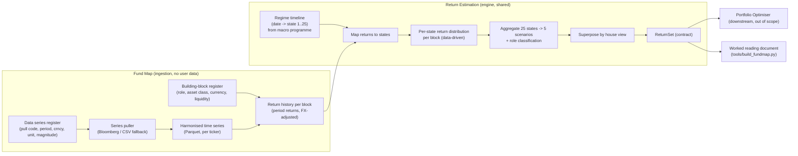

# CLAUDE_CODE: Fund Map and Return Estimation Programme

*Implementation-grade build spec for Claude Code. It defines the Fund Map instrument register and ingestion layer, the Return Estimation engine, the exact information contracts they exchange, the data-driven calibration, and the worked-output document the programme regenerates. Companion to the macro field-model programme; this is the second engine of the shared macro compute path.*

**Status:** Working spec v0.1.0 (fund map and return estimation)
**Reads with:** *andersCH - Engine Interconnection and Information-Flow Spec (Technical Blueprint)* (the DAG, the Regime and ReturnSet contracts, the regulated wall). The macro field-model programme produces the Regime; this programme consumes it.
**Stack:** Python 3.11+ (pandas, numpy, scipy), Bloomberg via `xbbg`/`blpapi` with a CSV fallback, Parquet for series storage, Jinja2 for the worked-output document. No web framework; this is a library plus a small CLI and a document generator.

---

## 0. House rules for this document and the build

These are inherited from the macro programme and are binding on every module, test, and generated output.

- British spelling throughout. No em-dashes anywhere, in code comments, docstrings, or generated prose.
- Only verified data. No fabricated or silently interpolated figures. Where a series is extended, proxied, or reconstructed, it carries an explicit label and the extension is recorded in provenance.
- Every number in a generated document is computed by the programme on a stamped vintage, never transcribed. The document is regenerated, not edited by hand.
- Every projected or estimated path is labelled model-derived, not a forecast.
- Context accompanies every number: the vintage, the calibration window, the currency, and the rule or method that produced it.
- Determinism. Every engine run is a pure function of `(inputs, version)`. No wall-clock time and no unseeded randomness outside declared inputs. An `idempotency_key = hash(inputs + version)` deduplicates; a `trace_id` enables replay.
- Semantic versioning on the programme, every engine, every contract, and the instrument universe. Every output records the versions that produced it plus the `regime_id` it was computed under.
- Read the binding condition first and the number second. Any output that reports a level must also report which rule or regime produced it.

---

## 1. Purpose and scope

The programme turns an instrument universe and a macro Regime into **phenomenological return profiles per building block across the regime states**, and superposes them by the house view into a `ReturnSet`. It is deliberately **not** mean-variance: there is no expected-return vector, no variance, and no covariance matrix on the output. A building block carries a return profile over the scenario states, organised by the four roles, and the optimiser downstream integrates that profile against the mandate through an asymmetric squared-shortfall objective, never through a frontier.

Two modules, one pipeline:

1. **Fund Map**: the instrument-universe register and the time-series ingestion layer. It defines the building blocks, pulls their series (Bloomberg pull codes, periodicity, currency, magnitude, unit), harmonises them, and computes the return history per block.
2. **Return Estimation**: the engine. It maps each block's return history onto the historical 25-state regime timeline supplied by the macro field-model programme, estimates the per-state return distribution data-driven, aggregates to the five scenarios, classifies the role, and emits the `ReturnSet` contract superposed by the house view.

The programme also regenerates a **worked reading document** in the SIM house style (the fund-map analogue of `schulung_us.html`), so the register, the estimates, and the coverage can be read and audited on a stamped vintage.

**Out of scope for v0.1.0** (state the absence so it is not mistaken for a finding): the Portfolio Optimiser, the per-user Life Balance Sheet, the regulated wall, and the macro field-model itself. This programme consumes the Regime; it does not compute it.

---

## 2. System overview: the compute DAG



The rule the DAG encodes: **the Fund Map is population-level and carries no user data; Return Estimation reads the shared Regime timeline by reference and never recomputes the macro model; the ReturnSet is emitted as a versioned contract keyed to the `regime_id` it was computed under.**

---

## 3. Data model

### 3.1 Building block (the Fund Map register)

Each row is one building block. The bootstrap dataset of 54 rows is supplied and is both the target schema and the seed values until the data-driven estimation is live. Fields, with the enumerations observed in the seed:

| Field | Type | Notes |
|---|---|---|
| `id` | int | Stable identifier. |
| `names` | list[str] | English and German label, comma-separated in the seed (`"US Equities,US Aktien"`). Split into `name_en`, `name_de`. |
| `ticker` | str | Bloomberg ticker (`MXUS Index`, `XAU BGN Curncy`). Joins to the Data series register. |
| `asset_class` | enum | `Equity`, `Fixed Income`, `Real Estate`, `Alternative`, `Cash`. |
| `role` | enum | `Growth`, `Income`, `Stabilization`, `Protection`. Map `Growth -> Gain` for the framework's four roles (Gain, Income, Stabilisation, Protection). |
| `home_scenario` | enum | The scenario the block is built for: `Expansion`, `Stagnation`, `Contraction`, `Crisis` (no `Boom` in the seed). Used for the coverage check, not for estimation. |
| `ret_distribution` | list[float] length 25 | The phenomenological return profile over the 25 regime states. See 3.2. In the seed these are hand-set IC values; the estimation replaces them. |
| `region` | enum | Seed column `Risk Signal`: `Europe`, `Americas`, `Asia`, `Sino`, `Global`. |
| `economic_phase` | enum | Capital-cycle phase of the block's market: `Foundation`, `Maturing`, `Optimizing`, `Saturation`. Reconcile against the macro Regime phase set (`Foundation`, `Build-up`, `Optimisation`, `Saturation`); `Maturing` is a fifth label to pin (section 12). |
| `capital_type` | enum | `Real`, `Financial`. |
| `currency` | str | ISO currency of the series. |
| `liquidity` | enum | `Daily`, `Quarterly`, `Yearly`, `Decade`. Drives the periodicity handling and a liquidity haircut flag, not the estimation directly. |
| `esg` | int | ESG eligibility flag (seed all `1`). |

**The `ret_distribution` semantics (working interpretation, to confirm).** The 25 values are the block's return in each of the 25 regime states, ordered from the **worst macro state (crisis-like, index 0) to the best macro state (boom-like, index 24)**. Evidence from the seed: growth blocks ascend monotonically (id 5 US Equities, `-40 ... +16`), protection blocks descend monotonically (id 33 Gold `50 ... 0`, id 37 Long Volatility `40 ... -3`, id 53 Short MSCI US `16 ... -40`). The estimation must reproduce this ordering convention exactly so seed and estimate are comparable. Units are percent returns per the block's natural holding period; normalise to a single stated horizon in the contract.

### 3.2 The 25 states and the five scenarios

The 25 states are the macro field-model's regime classifier states. The five scenarios are the coarse phase set the ReturnSet exposes: `boom`, `expansion`, `stagnation`, `contraction`, `crisis`. The programme must hold an explicit, versioned **state-to-scenario map** (a partition of the 25 ordered states into the 5 scenarios, crisis at the low index end, boom at the high index end). Estimation is done at 25-state granularity and aggregated to 5 scenarios through this map; finer grids (17 or 25) are allowed on the contract where a consumer wants them.

### 3.3 Data series (the ingestion register)

Mirrors the Notion *Data series* data source. One row per pullable series:

| Field | Type | Notes |
|---|---|---|
| `ticker` | str | Title, joins to the building block. |
| `pull_code` | str | Bloomberg field or override code. |
| `period` | enum | `M`, `Q`, `A` (monthly, quarterly, annual). |
| `crncy` | enum | `LCY`, `USD`, `NA`, `--`. |
| `magnitude` | enum | `Tn`, `Bn`, `100 Mn`, `Mn`, `th`, `Crore`, `Lvl`, `Pct`, `Bse`. |
| `unit` | enum | `PX`, `%`, `+/-`, `:`, `#`. Determines whether the series is a price (take returns) or already a rate. |
| `country`, `categories`, `index` | relation | Joins for grouping and for the FX-exposure formula. |
| `status` | enum | Ingestion status; only complete series feed estimation. |
| `date_frame` | str | Available history window. |

The puller resolves `pull_code`, converts magnitude to a common base, applies the `crncy` and FX handling, and writes a harmonised Parquet series per ticker with an explicit vintage stamp.

### 3.4 Regime timeline (input, from the macro programme)

A read-only contract produced by the macro field-model programme: a dated series mapping each period to a regime state.

```json
{
  "regime_timeline_id": "RTL-...", "economy_scope": "Global", "model_version": "ms@2.3.0",
  "as_of": "2026-07-01", "period": "M",
  "state_grid": 25,
  "path": [ { "date": "1998-01", "state": 7 }, { "date": "1998-02", "state": 7 } ],
  "current": { "regime_id": "REG-01J...", "state": 14, "phase": 3, "saturation_pct": 312.0 },
  "provenance": { "data_vintage": "2026-06", "sources": ["BIS", "IMF", "OECD"] }
}
```

If a scope-matched timeline is unavailable, Return Estimation must refuse to emit a ReturnSet rather than invent states.

### 3.5 ReturnSet (output contract)

Emitted exactly as the Technical Blueprint defines it. No `mu`, `sigma`, or covariance anywhere. A building block's return is a profile over the scenario states; the house view weights those states.

```json
{
  "return_set_id": "RS-...", "regime_id": "REG-01J...", "as_of": "2026-07-01",
  "model_version": "re@0.1.0", "universe_version": "fm@0.1.0", "horizon_years": 10,
  "state_grid": 25,
  "scenarios": ["boom","expansion","stagnation","contraction","crisis"],
  "state_to_scenario": { "0": "crisis", "1": "crisis", "12": "stagnation", "24": "boom" },
  "house_view": { "boom": 0.10, "expansion": 0.30, "stagnation": 0.25, "contraction": 0.20, "crisis": 0.15 },
  "role_profiles": {
    "gain":          { "boom": 0.14, "expansion": 0.08, "stagnation": 0.01, "contraction": -0.10, "crisis": -0.28 },
    "income":        { "boom": 0.05, "expansion": 0.045, "stagnation": 0.035, "contraction": 0.02, "crisis": -0.02 },
    "stabilisation": { "boom": 0.02, "expansion": 0.02, "stagnation": 0.02, "contraction": 0.015, "crisis": 0.00 },
    "protection":    { "boom": -0.02, "expansion": -0.01, "stagnation": 0.01, "contraction": 0.06, "crisis": 0.18 }
  },
  "building_blocks": [
    {
      "bb_id": "US-EQ", "ticker": "MXUS Index", "role": "gain", "region": "Americas",
      "profile_by_state": [ -0.40, -0.30, -0.22, -0.17, -0.12, -0.09, -0.07, -0.04, 0.00, 0.01, 0.02, 0.02, 0.02, 0.02, 0.03, 0.04, 0.04, 0.05, 0.06, 0.07, 0.09, 0.10, 0.11, 0.13, 0.16 ],
      "profile_by_scenario": { "boom": 0.12, "expansion": 0.06, "stagnation": 0.01, "contraction": -0.11, "crisis": -0.30 },
      "estimation": { "method": "data-driven", "n_obs_by_state": [ 3, 5, 8 ], "coverage": "partial", "label": "model-derived" }
    }
  ],
  "provenance": { "data_vintage": "2026-06", "series_sources": ["Bloomberg"], "calibration_window": "1998-01 to 2024-12" }
}
```

**Contract rule.** A consumer optimiser must reject a ReturnSet whose `regime_id` does not match the `regime_id` on the balance-sheet snapshot it is optimising. No mixing of regime vintages. This programme only produces the ReturnSet; it enforces that the `regime_id` and `state_to_scenario` it stamps are the ones the estimation actually used.

---

## 4. The Fund Map module

### 4.1 Universe definition

The register is authored from the seed dataset and maintained as a versioned table (`fm@MAJOR.MINOR.PATCH`). Loading the seed is the first acceptance test: 54 rows, all enumerations valid, `ret_distribution` length exactly 25 for every row, monotonicity direction consistent with the role (ascending for Growth, descending for Protection blocks; Income and Stabilisation flat-to-mild).

### 4.2 Ingestion

For each building block, join to the Data series register on `ticker`, resolve the `pull_code`, and pull the raw series for the widest available window. Handle, in this order and each as an explicit, logged step:

1. **Magnitude** to a common base (`Tn`, `Bn`, `Mn`, and so on to a level).
2. **Unit**: if `PX`, compute period returns; if already a rate (`%`, `+/-`), use as-is with the meaning recorded.
3. **Periodicity**: resample to a single estimation frequency (default monthly). Lower-frequency series (`Q`, `A`, `Decade`, `Yearly` liquidity) are flagged and either held at native frequency for a separate low-frequency estimation path or forward-mapped with an explicit interpolation label. Never silently interpolate into the monthly grid.
4. **Currency and FX**: convert to the block's stated currency or a common base per the `crncy` rule and the FX-exposure formula; record the FX handling. Currency conversion is a level operation and must not alter the ordering of states, so test that state ordering is invariant to the base currency chosen.

Write one harmonised Parquet series per ticker with a vintage stamp and a provenance record (source, pull code, window, transforms applied). Return history per block is the harmonised series turned into period returns.

### 4.3 Proxies and short histories

Several seed rows reuse a proxy ticker (id 45 and 47 both map to `MXWO Index`; id 48 to `SWIIT Index`). Record the proxy relation explicitly and label any block estimated from a proxy as `proxy` in the estimation block of the contract. A block whose own history is too short for per-state estimation (see 5.3) inherits its role-and-region peer profile with a `borrowed` label, never a silent fill.

---

## 5. The Return Estimation engine

This is where the framework's rejection of mean-variance becomes concrete. The engine estimates a **family of conditional return distributions, one per state**, and never a single stationary moment set.

### 5.1 Map returns to states

Align each block's return history to the Regime timeline by date. Each period return is tagged with the state that was active in that period. The result is, per block, a set of returns grouped into up to 25 state buckets.

### 5.2 Per-state estimation (data-driven)

For each block `b` and each state `s`, from the bucketed returns estimate the state's return summary the profile needs. The contract carries a single representative return per state (`profile_by_state[s]`), and the engine also retains the richer per-state distribution for the aggregation and for diagnostics:

- Central estimate per state: the state mean `mu_{b,s}` (robust variant: trimmed mean or median where the bucket is small or fat-tailed). This populates `profile_by_state`.
- Dispersion per state `sigma_{b,s}`, and where the bucket allows, skew and a tail quantile, retained for diagnostics and for the crisis-tail honesty check.
- Regime-conditional cross-block covariance `Cov_s(R_i, R_j)` per state, retained for downstream use but never collapsed into a single stationary matrix on the output.

The relationship to the unconditional estimate is the mixture identity, used as a validation check rather than as the estimator. With long-run state frequencies `pi_s` from the Regime timeline,

```
f(R) = sum_s pi_s f_s(R),   mu = sum_s pi_s mu_s
Var(R) = sum_s pi_s sigma_s^2  +  sum_s pi_s (mu_s - mu)^2      # within + between
Cov(R_i,R_j) = sum_s pi_s Cov_s(R_i,R_j) + sum_s pi_s (mu_i^s - mu_i)(mu_j^s - mu_j)
```

The engine must confirm that the frequency-weighted per-state estimates recompose to the block's unconditional sample moments within tolerance. The point of the estimator, though, is the per-state profile, because blending destroys exactly the crisis tail and the crisis correlation a portfolio needs (the between-regime variance term and the crisis-correlation term above are what a single-normal fit smears away).

### 5.3 Sufficiency and fallbacks

Set a minimum bucket size `n_min` (default 6 observations) for a state to be estimated from data. For under-populated states:

- Interpolate across the ordered state axis from neighbouring estimated states, monotonicity-preserving, labelled `interpolated`. The state axis is ordered, so shape-preserving interpolation across it is legitimate where a raw bucket is thin.
- If too many states are thin, fall back to the role-and-region peer profile (`borrowed`) or, last, the seed IC value (`seed`), each labelled.

Record `n_obs_by_state` and a per-block `coverage` grade on the contract. Never emit an unlabelled estimate.

### 5.4 Aggregate to scenarios and classify role

Aggregate the 25-state profile to the 5-scenario profile through the versioned `state_to_scenario` map, weighting within a scenario by the state frequencies. Classify or confirm the block's role from the shape of its profile across the states (ascending into boom is Gain; rising into crisis is Protection; flat positive is Income or Stabilisation), and reconcile against the register's declared role, flagging any mismatch rather than overwriting silently.

### 5.5 Roles, scenarios, and coverage

Assemble the role profiles and, for a candidate or reference allocation, evaluate the portfolio map from *Roles and Scenarios*:

```
R_P^s = sum_b w_b P_{b,s}                 # portfolio return in scenario s
coverage:  sum_b w_b P_{b,s} >= R_E^s     for every scenario s
resilience:  R = min_s ( R_P^s - R_E^s )  # worst funding margin across scenarios
```

`R >= 0` means the portfolio covers every scenario column; `R` is the map's scalar summary and is dominated by the failing column, not the flattering average. The engine exposes `P_{b,s}`, and, given a mandate profile `R_E^s`, computes `R` for any supplied weights. It does not choose weights (that is the optimiser).

### 5.6 House view and superposition

Given the house view `omega_s` (a probability weighting over the scenarios with explicit, non-zero tail weight), superpose the block profiles into the role profiles and stamp `house_view` on the contract. The house view is the Investment Committee input; default it to the seed weighting and make it an explicit, versioned argument. The engine emits the profile set plus the weights, never moments.

---

## 6. Determinism, versioning, provenance

- Every engine call is `EngineCall<In, Out>` with `engine`, `version`, `inputs` (by reference id, not copies), and `idempotency_key = hash(inputs + version)`. Every result carries `provenance { data_vintage, sources, engine_version }` and a `trace_id`.
- The ReturnSet stamps `model_version` (re@...), `universe_version` (fm@...), the `regime_id`, the `state_to_scenario` version, and the calibration window.
- The instrument universe, the state-to-scenario map, and the house view are each versioned and recorded on every output.
- No engine reads wall-clock time or unseeded randomness outside declared inputs. Re-running `(inputs, version)` reproduces the ReturnSet bit-for-bit.

---

## 7. Repository layout

```
fund_map_return_estimation/
  pyproject.toml
  README.md
  src/fmre/
    __init__.py
    version.py                 # programme + engine semver
    registers/
      building_blocks.py       # Fund Map register load + validation
      data_series.py           # ingestion register
      seed/fund_map_seed.csv   # the 54-row bootstrap dataset
      seed/state_to_scenario.json
    ingest/
      puller.py                # Bloomberg (xbbg/blpapi) + CSV fallback
      harmonise.py             # magnitude, unit, periodicity, FX
      returns.py               # period returns per block
    regime/
      timeline.py              # load + validate the Regime timeline contract
    estimate/
      map_states.py            # align returns to states
      per_state.py             # per-state distribution estimation
      fallbacks.py             # sufficiency, interpolation, borrow, seed
      aggregate.py             # 25 -> 5, role classification
      coverage.py              # performance matrix, coverage, resilience
      house_view.py            # superposition
    contracts/
      returnset.py             # typed ReturnSet build + validate
      schemas/                 # JSON Schema for every contract
    cli.py                     # build-returnset, validate, ingest
  tools/
    build_fundmap.py           # regenerates the worked reading document
    templates/fundmap.html.j2  # SIM house-style template
  tests/
    test_seed_load.py
    test_ingest_invariants.py
    test_per_state.py
    test_mixture_recompose.py
    test_coverage_resilience.py
    test_contract_schema.py
    test_determinism.py
```

---

## 8. Testing and acceptance criteria

Unit tests are invariants, not just examples. The programme is judged on them in this order.

1. **Seed integrity.** 54 rows load; every `ret_distribution` has length 25; role-consistent monotonicity holds; all enumerations valid.
2. **Ingestion invariants.** Magnitude, currency, and indexing are multiplicative level operations, so they must leave state ordering, direction, and the sign of period returns unchanged. Test that changing the base currency does not change which state is best or worst for a block.
3. **State mapping.** Every return is tagged with exactly the state active in its period; no return is dropped or double-counted; `n_obs_by_state` sums to the usable history length.
4. **Mixture recomposition.** Frequency-weighted per-state means and variances recompose to the block's unconditional sample moments within tolerance (the identity in 5.2).
5. **Labelling.** No emitted estimate is unlabelled; every `interpolated`, `borrowed`, `proxy`, `seed`, or `data-driven` value carries its label and `n_obs_by_state`.
6. **Coverage and resilience.** On the worked coverage matrix, an equities-and-credit-only book scores `R < 0` (crisis and contraction columns empty) and a diversified book scores `R >= 0`, reproducing the *Roles and Scenarios* worked example.
7. **Contract schema.** Every ReturnSet validates against its JSON Schema; no `mu`, `sigma`, or covariance field appears on the output; `regime_id` and `state_to_scenario` are present and internally consistent.
8. **Determinism.** Two runs of the same `(inputs, version)` produce byte-identical ReturnSets.

Report an honest criteria table in the worked document (turning-point sense where applicable, coverage, calibration window, observation counts) so no estimate is quoted without its support.

---

## 9. The worked reading document

`tools/build_fundmap.py` regenerates a single HTML page in the SIM house style (the fund-map analogue of `schulung_us.html`): masthead with the programme version and vintage stamp, a tiles row (universe size, states covered, calibration window, current regime state and phase, resilience of the reference book), callouts that state the binding condition before the numbers, inline SVG figures (the per-state profile curves for representative blocks; the coverage heatmap `P_{b,s}` with the reference book's scenario returns against the mandate; the crisis column marked), provenance tables (series, pull codes, sources, vintages), and the disclaimer footer. Every figure is computed on the stamped vintage; the page is regenerated, not edited. Projected or estimated paths carry the model-derived label.

Reuse the design tokens and component classes from `schulung_us.html` (masthead, tiles, callout, fig, chip, provenance table, footer) so the two documents read as one set.

---

## 10. Build order

Build the shared ingestion and estimation path before anything downstream, because everything reads it.

1. Registers and seed load with validation (tests 1).
2. Ingestion: puller with CSV fallback, harmonisation, returns (tests 2).
3. Regime timeline loader and the state-to-scenario map (contract 3.4, 3.2).
4. State mapping and per-state estimation with fallbacks (tests 3, 4, 5).
5. Aggregation, role classification, coverage and resilience (tests 6).
6. ReturnSet build and schema validation, determinism (tests 7, 8).
7. House-view superposition and the CLI.
8. The worked reading document generator.

---

## 11. Contracts summary (producer to consumer)

| Contract | Produced by | Consumed by | Scope |
|---|---|---|---|
| Regime timeline | Macro field-model programme | Return Estimation | Shared (input) |
| Harmonised series | Fund Map ingestion | Return Estimation | Shared |
| ReturnSet | Return Estimation | Portfolio Optimiser (downstream), worked document | Shared (output) |

---

## 12. Open items to pin

1. **The 25-state ordering and the state-to-scenario map.** Confirm the crisis-at-index-0 to boom-at-index-24 ordering (section 3.1) and freeze the partition of 25 states into the 5 scenarios (section 3.2). The estimator and the seed must share this convention.
2. **`economic_phase` reconciliation.** The register uses `Foundation, Maturing, Optimizing, Saturation`; the macro Regime uses `Foundation, Build-up, Optimisation, Saturation`. Pin whether `Maturing` maps to `Build-up` or is a distinct fifth label, and whether this field is descriptive metadata or an estimation input.
3. **`home_scenario` has no Boom.** Confirm whether Boom is deliberately unused as a home scenario, or should be added for symmetry with the five-scenario ReturnSet.
4. **Return horizon.** Fix the single horizon the `ret_distribution` values are normalised to (annualised is the assumed default) so seed and estimate are comparable.
5. **House view ownership.** Confirm the house view is an Investment-Committee input with an explicit tail weight, defaulted to the seed weighting, and versioned.
6. **Low-frequency and illiquid blocks.** Pin the estimation path for `Quarterly`, `Yearly`, and `Decade` liquidity blocks (native-frequency estimation versus labelled forward-mapping).
7. **Covariance retention.** Confirm the regime-conditional covariance is retained for downstream use but never emitted on the ReturnSet, consistent with the no-moments rule.

---

*End of working spec v0.1.0. Next step: freeze the 25-state ordering and the state-to-scenario map (section 12.1), load the seed and stand up ingestion, then build the shared estimation path (Regime timeline to per-state estimation to ReturnSet) ahead of any downstream consumer, since everything reads it.*
