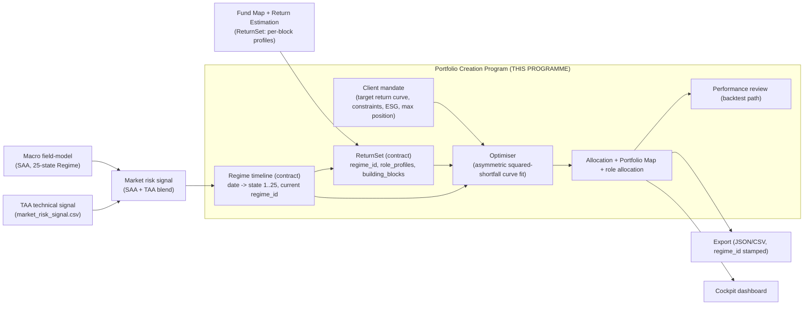

# CLAUDE_CODE: Portfolio Creation Program (Portfolio Optimiser)

*Implementation-grade build spec for Claude Code. It defines the Portfolio Creation Program (PCP), the downstream Portfolio Optimiser of the shared macro compute path. It specifies the contracts the PCP consumes (the Regime timeline and the ReturnSet), the mandate and client inputs it optimises against, the optimisation model of record (an asymmetric squared-shortfall curve fit, not mean-variance), the control cockpit, and the exact reconciliation against the existing MATLAB implementation.*

**Status:** Working spec v0.1.0 (portfolio creation and optimisation)
**Reads with:** *andersCH, Engine Interconnection and Information-Flow Spec (Technical Blueprint)* (the DAG, the Regime and ReturnSet contracts, the regulated wall). The macro field-model programme produces the Regime, the Fund Map programme produces the ReturnSet, this programme consumes both and produces the allocation. Companion to `CLAUDE_CODE_macro_field_model_program.md` and `CLAUDE_CODE_fund_map_return_estimation_program.md`.
**Reference implementation:** the working MATLAB PCP in `SIM_Tech/Master_Controller`: `Functions/PCP/Optimizer.m`, `curveoptimization.m`, `curveoptcalc.m`, `Dataloader.m`, `pf_map.m`, and the orchestration in `SIM_Master_Controller.m`. The Python port must reconcile numerically against it (section 9).
**Stack:** Python 3.11+ (numpy, scipy, pandas, PyYAML, openpyxl), FastAPI plus uvicorn for the cockpit (Plotly loaded in the browser from a CDN, no server-side plotting dependency), pytest. Pin dependencies in `requirements.txt`.

---

## 0. House rules for this document and the build

Inherited from the macro and Fund Map programmes and binding on every module, test, and generated output.

- British spelling throughout (optimise, optimiser, optimisation, normalise, stabilisation, behaviour, licence).
- No em-dashes anywhere, in code comments, docstrings, or generated prose. Use commas, parentheses, or colons.
- Only verified inputs. The PCP never fabricates or silently interpolates a return profile, a regime weight, or a mandate figure. A run that needs an unavailable input fails loudly rather than guessing.
- Every optimiser output is model-derived, not a forecast, and says so. Projected or backtested paths carry the model-derived label.
- Determinism. Every run is a pure function of `(inputs, version)`. No wall-clock dependence and no unseeded randomness. Record an `idempotency_key = hash(inputs + version)` and a `trace_id` for replay. The solver start point is fixed (section 4.3), so a given input set yields the same allocation.
- Semantic versioning on the programme, the optimiser engine, and every contract consumed or produced. Every output records the versions that produced it and the `regime_id` it was computed under.
- Context accompanies every number: the regime vintage, the ReturnSet vintage, the mandate identity, the currency, and the rule or bound that produced it.
- Read the binding condition first and the number second. Any reported exposure or weight also reports the constraint or regime that produced it.
- This is decision-support and research tooling, not investment advice. The disclaimer is present in the README, in every export, and in every generated brief.

---

## 1. Purpose and scope

The PCP builds a client portfolio by choosing instrument weights whose blended return profile best matches the client mandate's target return curve, under the mandate's allocation constraints, integrated over the current macro Regime. It is deliberately not mean-variance: there is no expected-return vector, no variance, and no covariance matrix in the objective. The optimiser integrates each building block's per-state return profile against the mandate through an asymmetric squared-shortfall objective, exactly the objective the Fund Map spec names for its downstream consumer (section 4.1). A mean-variance branch exists as an alternative strategy for comparison only (section 4.4).

The PCP sits on the user side of the regulated wall. The Fund Map is population-level and carries no user data; the Regime is population-level; the PCP is where the client mandate (the per-user target return curve and constraints, the Life Balance Sheet snapshot) meets the population-level ReturnSet and Regime to produce a specific allocation.

Two things the PCP produces: a **point allocation** for the current regime, and, in backtest mode, an **allocation path** over the historical regime timeline for performance review.

**Out of scope for v0.1.0** (stated so the absence is not read as a finding): computing the Regime (macro programme owns it), computing the ReturnSet (Fund Map owns it), the data ingestion of instrument series (Fund Map owns it), and the per-user Life Balance Sheet construction (its own programme). This programme consumes those; it does not compute them.

---

## 2. System overview: the compute DAG



The rule the DAG encodes: **the PCP reads the Regime and the ReturnSet by reference, never recomputes them, and stamps every allocation with the `regime_id` and the ReturnSet version it was computed under.** A ReturnSet whose `regime_id` does not match the Regime the mandate is being optimised against is rejected, not reconciled (section 3, contract rule).

The legacy MATLAB path implements this same DAG with the Regime arriving as `CRS` from `Market_Signal.m` (collapsed to `Market.PFMapAllocation`) and the ReturnSet arriving as the `Investment` return-distribution columns of the Controller workbook. The Python port keeps the algorithm and swaps those two inputs for the versioned contracts.

---

## 3. Inputs and contracts

### 3.1 Regime timeline (consumed, read-only, from the macro programme)

Produced by `macrofield` (`model/regime.py`, book section 20.2 taxonomy). A distribution over 25 states, ordered 1 cautious to 25 aggressive, that is, worst or crisis-like at the low index and best or boom-like at the high index. Five scenarios in the book order: crisis, contraction, stagnation, expansion, boom.

Contract shape (from the Technical Blueprint, mirrored by the macro programme):

```json
{
  "regime_timeline_id": "RTL-...", "economy_scope": "Global", "model_version": "ms@2.3.0",
  "as_of": "2026-07-01", "period": "M", "state_grid": 25,
  "path": [ { "date": "1998-01", "state": 7 }, { "date": "1998-02", "state": 7 } ],
  "current": { "regime_id": "REG-01J...", "state": 14, "phase": 3, "saturation_pct": 312.0 },
  "provenance": { "data_vintage": "2026-06", "sources": ["BIS", "IMF", "OECD"] }
}
```

For the optimiser, the object the objective integrates over is a 25-length probability vector `M` per period. Two supported forms:

- **Distribution per period** (preferred): a 25-length weight vector for the current period (and one per historical period in backtest). This is what `macrofield.model.regime` emits and what `SIM_Tech/Master_Controller/convictions.json` holds (25-length distributions per economy, stored sparsely as `{state_index: weight}`).
- **State path**: the `path` above (one integer state per date); expand to a 25-length one-hot or kernel-smoothed vector if a full distribution is not supplied.

In the legacy pipeline the per-period `M` is `Market.PFMapAllocation(t,:)`, built in `Dataloader.m` as the country-weighted sum of the per-country `CRS.Signal_*` matrices (`M = sum_k cw[k] * CRS.Signal_k`). Preserve that blend as the adapter that turns a multi-economy Regime into the single `M` the mandate's market scope requires (section 3.4).

### 3.2 ReturnSet (consumed, read-only, from the Fund Map programme)

Produced by `fmre`. Per building block, a phenomenological return profile over the 25 regime states, aggregated to the five scenarios and organised by the four roles. No `mu`, `sigma`, or covariance on the contract. Shape (abbreviated, full form in the Fund Map spec section 3.5):

```json
{
  "return_set_id": "RS-...", "regime_id": "REG-01J...", "as_of": "2026-07-01",
  "model_version": "re@0.1.0", "universe_version": "fm@0.1.0", "state_grid": 25,
  "scenarios": ["boom","expansion","stagnation","contraction","crisis"],
  "state_to_scenario": { "0": "crisis", "12": "stagnation", "24": "boom" },
  "house_view": { "boom": 0.10, "expansion": 0.30, "stagnation": 0.25, "contraction": 0.20, "crisis": 0.15 },
  "role_profiles": { "gain": {...}, "income": {...}, "stabilisation": {...}, "protection": {...} },
  "building_blocks": [
    { "bb_id": "US-EQ", "ticker": "MXUS Index", "role": "gain", "region": "Americas",
      "profile_by_state": [ -0.40, ..., 0.16 ],
      "profile_by_scenario": {...},
      "estimation": { "method": "data-driven", "coverage": "partial", "label": "model-derived" } }
  ],
  "provenance": {...}
}
```

`profile_by_state` is the length-25 curve the optimiser uses per instrument, ordered crisis-low (index 0) to boom-high (index 24). This is the exact object that the MATLAB `Investment.Returndis` (25 columns) held; keep the ordering convention identical so seed and estimate reconcile.

**Contract rule (binding).** The PCP must reject a ReturnSet whose `regime_id` does not match the `regime_id` of the Regime it is optimising against. No mixing of regime vintages. The optimiser records the `regime_id`, the ReturnSet `model_version`, and the `universe_version` on every allocation it emits.

### 3.3 Client mandate (consumed, user side of the regulated wall)

The mandate is the per-user input: a target return curve and the allocation constraints. In the reference implementation it lives in `Controller_Test.xlsx` (sheets `Client`, `Investment` universe flags, `Benchmark`) and is read by `Dataloader.m`. The Python port reads the same workbook via `openpyxl` initially, then optionally accepts a structured mandate config (section 6.1). The exact cell contract, to reproduce positionally:

`Client` sheet, locate the mandate column `IndexM` by matching row 1 (client name) and row 2 (mandate name), columns grouped in threes per (client, mandate):

| Field | Rows | Meaning |
|---|---|---|
| Name | 1 | client name |
| Mandate | 2 | mandate name |
| MaxSinglePositionSize | 4 | scalar upper bound per position |
| ESG | 5 | portfolio ESG minimum |
| ReturnDist | 8:32 | 25-point target return curve (the mandate objective curve `C`) |
| CurrencyCond | 35:44 (cols IndexM:IndexM+1 = LB, UB) | 10 currencies |
| RegionalCond | 47:53 | 7 regions |
| PhaseCond | 56:59 | 4 economic phases |
| TypeCond | 62:64 (see quirk in section 11) | 3 capital types |
| liquidityCond | 67:70 | 4 liquidity classes |
| RoleCond | 73:76 | 4 roles |
| AssetClassCond | 79:83 | 5 asset classes |

The investable universe is the set of building blocks flagged `"x"` under the mandate's column (Investment sheet, header row, columns 40 and beyond in the legacy sheet). Under the contract path, the universe is the ReturnSet `building_blocks` filtered to the mandate, and the per-instrument metadata (role, region, currency, asset class, phase, liquidity, ESG, capital type) comes from the ReturnSet and the Fund Map register rather than from the workbook.

### 3.4 The country-weight adapter (`cw`)

The mandate's `market` scope (Americas, Europe, Asia, Sino, Global) selects a 7-length country weight vector over (China, EU, India, US, Switzerland, Brazil, UK), used to blend multi-economy Regime signals into the single `M` for the mandate. Presets and an overwrite flag live in the Market_Settings sheet in the reference implementation. Decide, with the macro programme, whether `cw` belongs to the Regime producer or to this adapter, and document the decision in whichever module MD is authoritative. Until then, reproduce the legacy presets exactly.

---

## 4. The optimisation model of record

Implement exactly this. The formulas are taken from the working MATLAB and must reconcile against it (section 9).

### 4.1 Objective (`curveoptcalc.m`), the asymmetric squared-shortfall

For candidate weights `x` (length `n`, one per instrument), instrument profile matrix `BB` (n by 25, row j is `building_blocks[j].profile_by_state`), mandate target curve `C` (length 25), and Regime weight vector `M` (length 25):

```
y = sum over i in 1..25 of  ( sum over j in 1..n of  max( C[i] - M[i]*x[j]*BB[j,i], 0 ) )^2
```

Per regime state `i`, sum the positive shortfall of each instrument's regime-scaled contribution below the mandate target, square the summed shortfall, then sum across states. Minimise `y`. The shortfall is summed over instruments before squaring, matching `(sum(max(C-yhold,0)))^2` in `curveoptcalc.m`. The commented `sum((C-yhold).^2)` variant is not the active objective and must not be used. This asymmetry (penalising only the downside of the target curve, weighted by the live regime including its crisis tail) is the point of the method, and is why the crisis-tail weight the Regime carries must not be smoothed away upstream.

### 4.2 Constraints (`curveoptimization.m`)

Decision variable `x` in R^n, with `Aeq x = beq` where `Aeq = ones(1,n)`, `beq = 1` (weights sum to one).

Bounds per instrument: lower bound is the fixed allocation `FixedAllo[j]` (0 if none); upper bound `Max_Pos[j]` is `FixedAllo[j]` where that is non-zero (pins the position) else `MaxSinglePositionSize`.

Linear inequalities `A x <= b`, assembled block by block in this exact order (each classification block appears as `+block` for the upper bound then `-block` for the negated lower bound):

1. Currency (10)
2. Region (7)
3. Role (4)
4. Capital Type (3)
5. Liquidity (4)
6. ESG: a single row `-ESG . x <= -Client.ESG` (portfolio ESG at or above the mandate minimum; the ESG row is all ones)
7. Economic Phase (4)
8. Asset Class (5)

Each `block` is a k by n indicator matrix (1 where the instrument is in category k). For a dimension with per-category bounds `[LB, UB]`: `+block x <= UB` and `-block x <= -LB`. The `b` vector concatenates, per dimension in the order above, the UB column then the negated LB column. Match the `A` and `b` assembly of `curveoptimization.m` lines 32 to 34 exactly, including block order, or the port will not reconcile.

Fixed vocabularies (preserve order, the constraint rows depend on it):

- Role (4): Gain, Income, Stabilisation, Protection. The ReturnSet labels Growth for Gain; map `Growth -> Gain` on ingest.
- Scenario (5): the book order is Crisis, Contraction, Stagnation, Expansion, Boom (cautious to aggressive, low index to high). The legacy `pf_map.m` heatmap labels its axis Boom to Crisis for display; that is a display order only, the underlying state index runs crisis-low to boom-high.
- Economic Phase (4): Foundation, Build-up, Optimisation, Saturation (reconcile the Fund Map `Maturing` label, section 11).
- Capital Type (3): Financial, Real, Others.
- Asset Class (5): Cash, Fixed Income, Equity, Real Assets, Alternative.
- Liquidity (4): Daily, Quarterly, Yearly, Decade.
- Region (7): Switzerland, Europe, East Asia, South Asia, North America, South Pacific, Others.
- Currency (10): CHF, USD, EUR, RMB, GBP, JPY, HKD, AUD, INR, Others.

### 4.3 Solver

MATLAB uses `fmincon`. In Python use `scipy.optimize.minimize(method="SLSQP")` (fall back to `trust-constr` if SLSQP struggles on a mandate), with the linear equality `sum(x)=1`, the linear inequalities `A x <= b`, the per-instrument bounds, and the fixed start `x0 = 0.5 * ones(n)` (matching MATLAB, which keeps the run deterministic). Two speed modes:

| Mode | MATLAB | SciPy equivalent |
|---|---|---|
| fast | TolFun 1e-3, MaxFunEval 500, StepTol 1e-5, MaxIter 300, ConstrTol 1e-3 | ftol=1e-3, maxiter=300 |
| exact | TolFun 1e-8, MaxFunEval 5000, StepTol 1e-10, MaxIter 3000, ConstrTol 1e-8 | ftol=1e-8, maxiter=3000 |

After solving, record `conditions_met = "yes" if round(sum(x),1)==1 else "no"`, then renormalise `x = x / sum(x)` (as `Optimizer.m` does).

### 4.4 Mean-variance alternative (comparison only, `translate_PCP_MV.m`, `pointoptimization.m`)

When enabled, swap the curve fit for a point mean-variance optimisation behind one `optimise(...)` interface. The adapter `translate_PCP_MV` builds a 24-month rolling covariance and a risk-aversion scalar `M_MV(t)` from the regime peak and (optionally) the mandate return profile:

```
M_MV = 5 / mean( argmax(regime) + mean((1:25) * regime) )
if risk_aversion:  M_MV = 1.25 * ( M_MV - 2.5 * std(ReturnDist) / (-min(ReturnDist)) )
if not market_risk: M_MV = 10
```

This branch reintroduces a covariance matrix and is therefore off the framework's main path; keep it clearly labelled as a comparison optimiser, not the model of record. Depend on `CLAUDE_CODE` for the MV module (or its README) for the exact `pointoptimization` maths.

---

## 5. Outputs

Per optimised period (current regime, and each historical period in backtest), assemble the result the MATLAB `Optimizer.m` produces:

- `allocation`: normalised weights, one per building block.
- `return_dist_final`: `allocation' * BB` (length 25), the achieved portfolio curve.
- `portfolio_map`: the 4 by 5 Role by Scenario grid from `pf_map.m` (`PF_Map[role, scenario] += weight`). Rows are Roles (Gain, Income, Stabilisation, Protection), columns are the five scenarios.
- `role_allocation`: per-role totals (column sums of the portfolio map).
- `esg`: weighted-average ESG.
- `instruments`: the building-block ids and names of the optimised universe.
- `conditions_met`, and the binding constraints that were active.
- Stamps: `regime_id`, ReturnSet `model_version` and `universe_version`, mandate identity, currency, `idempotency_key`, `trace_id`, `as_of`.

Backtest mode iterates the period index from `n = len(regime_path) - backtest` to the end (one solve per historical period), matching the MATLAB loop. Live mode solves only the current period.

Export machine-readable results as JSON and CSV through a single `reporting/export.py` write boundary (mirroring `macrofield.reporting.export`), so the regime vintage, the ReturnSet vintage, the model-derived label, and the disclaimer are attached where the file is written, not left to each caller. Suggested `pcp_result.json`:

```json
{
  "header": { "client": "...", "mandate": "...", "market": "...", "currency": "...", "as_of": "YYYY-MM-DD",
              "regime_id": "REG-...", "return_set_id": "RS-...", "engine_version": "pcp@0.1.0",
              "idempotency_key": "...", "trace_id": "...", "disclaimer": "..." },
  "allocation": [ { "bb_id": "US-EQ", "name": "US Equities", "weight": 0.05, "role": "gain",
                    "region": "Americas", "currency": "USD", "asset_class": "Equity" } ],
  "portfolio_map": [[...],[...],[...],[...]],
  "role_allocation": { "gain": 0.0, "income": 0.0, "stabilisation": 0.0, "protection": 0.0 },
  "return_dist_target": [ 25 values ],
  "return_dist_final": [ 25 values ],
  "regime": [ 25 values ],
  "esg": 0.0, "conditions_met": "yes",
  "timeline": [ { "period": "YYYY-MM", "allocation": [ ... ] } ]
}
```

Keep the legacy `send2server` behaviour as an optional export target (the MATLAB controller POSTs JSON to the SIM sandbox); when enabled, POST the same payload.

---

## 6. Control interface: the cockpit

Build the control surface as a **cockpit**, the same pattern as the macro programme's `macrofield cockpit`: a local dashboard served on localhost by the CLI, FastAPI plus uvicorn on the backend, a single-page front end (`cockpit/static/index.html`) that plots client-side with Plotly loaded from a CDN. The cockpit is a control surface over the same code paths the CLI uses, not a second implementation: every endpoint calls the shared pipeline, optimiser, and reporting modules, so a result seen in the cockpit is the result the CLI would write. Follow the macro cockpit's conventions:

- The server sends data, the browser draws. Endpoints return JSON traces, the front end renders them.
- Every response carries its provenance (regime vintage, ReturnSet vintage, mandate identity, the binding constraints).
- Failures are returned as results, not as HTTP 500s: an infeasible mandate or a mismatched `regime_id` comes back as a normal response with `ok: false` and a readable reason, and the front end shows it.

### 6.1 Config (replaces the Controller control cells)

Expose the Master-Controller control cells as a structured config (YAML, mirroring `macrofield` `config/defaults.yaml`) so the cockpit and CLI drive runs without editing Excel. Map the legacy cells: from `Main_Controller`, the client, mandate, market, benchmark, currency, backtest length (max 240 months), performance-review flag, opti_scale (Default, Defensive, Aggressive, Rogue), create-video flag, data source (bloomberg or saved), and speed (fast or exact); from `Expert_Controller`, the sim-monthly, portfolio-challenge, mv-optimiser, send-to-server, mv-risk-aversion, and mv-market-risk flags plus the four portfolio-challenge presets; from `Market_Settings`, the model weights, sub-index weights, and the `cw` overwrite and presets. Thresholds and presets live in config, never as magic constants in code.

### 6.2 Cockpit views (minimum)

1. Run panel: choose client, mandate, market, benchmark, currency, opti_scale, speed, backtest length, and optimiser (curve or the MV comparison); Run triggers the optimiser.
2. Allocation: bar chart of final weights by building block, with role, region, currency, and asset-class breakdown tables.
3. Portfolio Map: the 4 by 5 Role by Scenario heatmap.
4. Return curve fit: the mandate target curve against the achieved curve (overlay, 25 states).
5. Regime tilt: the 25-length `M` vector as an area chart, with the crisis-tail weight visible and the `regime_id` shown.
6. Backtest and performance: allocation evolution over the regime timeline, and the performance-review outputs, every projected path labelled model-derived.
7. Constraints and feasibility: realised exposures against the mandate bounds, and `conditions_met`.

---

## 7. Repository layout

Self-contained package, adapt to repo conventions (mirrors `macrofield`).

```
pcp/
  __init__.py            # __version__
  config.py              # load and validate YAML config and mandate; the fixed vocabularies (section 4.2)
  contracts.py           # dataclasses: Regime, ReturnSet, Mandate, Allocation, Result; regime_id checks
  ingest/
    regime.py            # read the Regime timeline / convictions.json -> 25-length M per period
    returnset.py         # read the ReturnSet -> BB matrix and per-instrument metadata
    mandate.py           # read the Controller workbook (openpyxl) or a mandate config -> Mandate
  model/
    objective.py         # curveoptcalc (asymmetric squared-shortfall)
    constraints.py       # build A, b, Aeq, bounds in the exact order of section 4.2
    optimiser_curve.py   # curveoptimization: assemble and solve with SLSQP
    optimiser_mv.py      # translate_PCP_MV + pointoptimization adapter (comparison only)
    pfmap.py             # pf_map (4x5 Role by Scenario)
  pipeline.py            # orchestrates ingest -> optimise -> result (curve|mv), live and backtest loops
  reporting/
    export.py            # JSON and CSV at one write boundary, stamps + disclaimer
    brief.py             # short model-derived prose brief, no em-dashes, disclaimer
  cockpit/
    server.py            # FastAPI app; endpoints call pipeline and reporting
    static/index.html    # single-page front end, Plotly from CDN
  cli.py                 # argparse entry points (section 8)
  tests/
config/
  defaults.yaml
requirements.txt
```

---

## 8. Engineering standards

- Python 3.11+, numpy, scipy, pandas, PyYAML, openpyxl; FastAPI and uvicorn for the cockpit only (the CLI names them if missing, as the macro cockpit does). Pin every dependency in `requirements.txt`.
- Config-driven: YAML defaults plus a per-mandate config. No magic constants; the vocabularies, the opti_scale presets, the `cw` presets, and the solver tolerances live in config with the values from section 4.
- Deterministic and reproducible: fixed solver start, `idempotency_key` and `trace_id` on every run, offline runs from cached contracts, no wall-clock dependence.
- Semantic versioning on the programme and on the consumed and produced contracts; every output records the versions and the `regime_id`.
- CLI (argparse, exit codes 0 success, 1 handled failure such as an infeasible mandate or a `regime_id` mismatch, 2 usage error), in the macro programme's command style:
  - `pcp optimise --mandate <name> [--speed exact] [--optimiser curve|mv]`
  - `pcp backtest --mandate <name> --months 240`
  - `pcp report --mandate <name>`
  - `pcp mandates` (list configured mandates)
  - `pcp cockpit` (serve the dashboard)
- Tests: unit tests for the objective (against a hand-computed small case), for the constraint assembly (order and bounds), for `pf_map`, for the ingest of each contract (including the `regime_id` mismatch rejection), a determinism test (same inputs give the same allocation), and at least one end-to-end reconciliation test against the MATLAB golden run (section 9).

---

## 9. Validation against the MATLAB reference

The port is not done until it reconciles with the working MATLAB.

- Golden run: run `SIM_Master_Controller.m` for a fixed config (for example client SIM, mandate Global, market Global, benchmark Swiss, currency CHF, speed exact, backtest 0) and dump the loaded `Client`, `Investment`, `Market.PFMapAllocation`, and the resulting `Allocation`, `ReturnDistFinal`, and `PortfolioMap` to `.mat` or CSV.
- Ingest test: assert the Python-loaded mandate, universe, `BB` matrix, and `M` vector equal the MATLAB structures cell for cell.
- Objective test: feed identical `x, BB, C, M`; assert `curveoptcalc` matches to about 1e-10.
- Optimiser test: with speed exact, assert the final `allocation` matches within tolerance. Note SLSQP and fmincon can differ slightly at a non-unique optimum, so compare the objective value and the role and region exposures, not only the raw weights (weights within about 1e-3 where the optimum is unique).
- pf_map test: identical 4 by 5 grid.
- Add `tests/test_reconcile_matlab.py` reporting the maximum absolute difference per output, and have a reviewer (or a sub-agent) check the constraint-assembly order against `curveoptimization.m` before sign-off.

---

## 10. Acceptance checks

Before finishing, verify:

1. The objective matches `curveoptcalc.m` exactly (asymmetric squared-shortfall, shortfall summed over instruments before squaring), and the objective test passes to tolerance.
2. The constraint blocks are assembled in the exact order of section 4.2, with the correct bounds, and the reconciliation test passes.
3. The PCP consumes the Regime and the ReturnSet as versioned contracts, rejects a ReturnSet whose `regime_id` does not match the Regime, and stamps `regime_id` and the contract versions on every output.
4. The cockpit runs, drives the same code paths as the CLI, returns failures as `ok: false` results, and carries provenance on every response.
5. A run is deterministic: the same inputs and version give the same allocation, with `idempotency_key` and `trace_id` recorded.
6. British spelling throughout, no em-dashes anywhere, model-derived labels on projected and backtested paths, and the not-investment-advice disclaimer in the README, every export, and every brief.

Deliver a change report: the modules built, the contracts wired with their versions, the reconciliation quality against the MATLAB golden run, and anything left for review.

---

## 11. Known quirks and open questions (surface to Nicolas, do not silently fix)

- Capital Type header swap. In `Client` the Capital Type block header reads `UB | LB` (columns swapped) while every other block reads `LB | UB`; `Dataloader.m` reads positionally, so column one is used as the lower-bound position regardless of the header. Reproduce the positional read for bit-compatibility and add a flagged TODO to confirm the intended bounds.
- Scenario and phase vocabularies across modules. The book and the Regime use crisis to boom (five scenarios) and Foundation, Build-up, Optimisation, Saturation (four phases). The Fund Map register uses a `Maturing` fifth phase label and a `home_scenario` without Boom in the seed. Pin one canonical set and record the mapping, do not let each module drift.
- `cw` ownership. `Market_Signal.m` notes the country-weight vector "should come in as an input"; decide whether the Regime producer or the PCP adapter owns `cw` and document it.
- Regime delivery form. Confirm whether the macro programme delivers a per-period 25-length distribution (preferred) or only a state path; the objective needs the distribution, so the adapter must expand a path if that is all that is supplied.
- ReturnSet horizon and units. `profile_by_state` values are percent returns on a stated horizon; confirm the horizon the mandate target curve `C` is expressed on and normalise both to the same horizon before the fit.

---

## 12. References (for grounding, not for reproduction)

- Steiner, N., and Bürkler, N. *Capital Saturation: A Field-Theoretic Framework for Investment and Socioeconomic Analysis*. SIM Research Institute AG. Chapter 20 (economic state model and regime dynamics, the five scenarios and the 25-state distribution), and the Roles and Scenarios treatment behind the portfolio map.
- *andersCH, Engine Interconnection and Information-Flow Spec (Technical Blueprint)*: the compute DAG, the Regime and ReturnSet contracts, the regulated wall.
- `CLAUDE_CODE_macro_field_model_program.md` (the Regime producer, section 0.8) and `CLAUDE_CODE_fund_map_return_estimation_program.md` (the ReturnSet producer, sections 3.4, 3.5, and 5).
- The MATLAB reference implementation in `SIM_Tech/Master_Controller/Functions/PCP` and `SIM_Master_Controller.m`.
```
